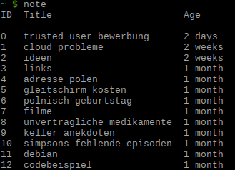

.. pynote documentation master file, created by
   sphinx-quickstart on Tue Jan 28 11:35:42 2014.

Welcome to pynote's documentation!
==================================

Contents
--------

.. toctree::
   :maxdepth: 2

   quickstart
   commands
   Configuration <configuration>
   changelog
   contributing
   thanks

Useful Links
------------

* `Pypi Package`_
* `cgit`_
* `Github`_
* `Arch Linux Support Thread`_

.. _`Pypi Package`: https://pypi.python.org/pypi/pynote
.. _`cgit`: http://cgit.sevenbyte.org/pynote/
.. _`Github`: https://github.com/statschner/pynote
.. _`Arch Linux Support Thread`: https://bbs.archlinux.org/viewtopic.php?pid=1362268
